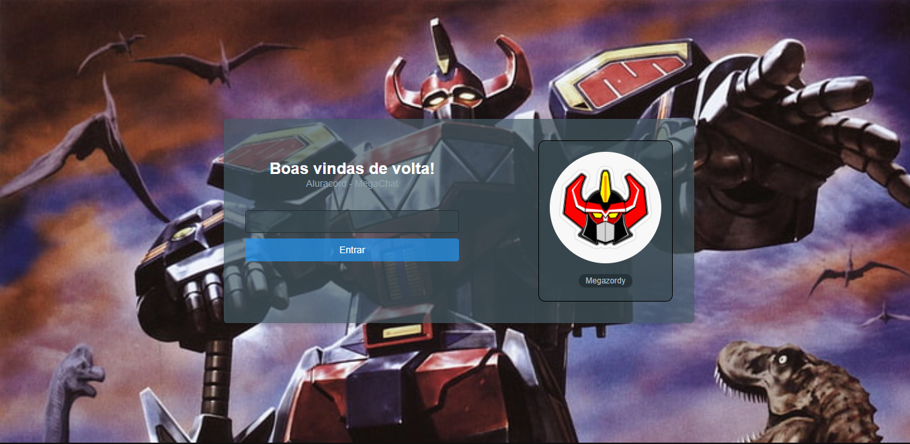
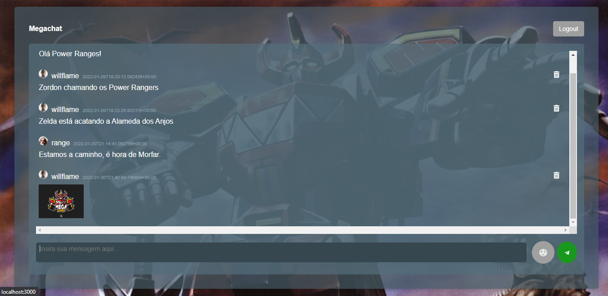
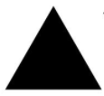

<h1 style="text-align: center;">AluraCord  - MegaChat</h1>

    <a href="#-projeto">Projeto</a>&nbsp;&nbsp;&nbsp;|&nbsp;&nbsp;&nbsp;
    <a href="#-demo">Projeto</a>&nbsp;&nbsp;&nbsp;|&nbsp;&nbsp;&nbsp;
    <a href="#-conhecimentos">Conhecimentos</a>&nbsp;&nbsp;&nbsp;|&nbsp;&nbsp;&nbsp;
    <a href="#-funcionalidades">Conhecimentos</a>&nbsp;&nbsp;&nbsp;|&nbsp;&nbsp;&nbsp;
    <a href="#-tecnologias">Tecnologias</a>&nbsp;&nbsp;&nbsp;|&nbsp;&nbsp;&nbsp;
    <a href="#-layout">Layout</a>&nbsp;&nbsp;&nbsp;|&nbsp;&nbsp;&nbsp;
    <a href="#memo-licença">Licença</a>

    
    

 

    
    

 

## 💻 Projeto

Projeto desenvolvido durante a Imersão React da Alura, focando em construir um chat para conversa em tempo real com mais pessoas na mesma página, utilizando tecnologias open source.

## Demo
[Vizualizar projeto](https://alura-cord-gamma.vercel.app/)

## 🏆 Conhecimentos
- Criação de um projeto com Next.js;
- Criação de componentes com React utilizando CSS in JS;
- Passagem de propriedde para os componentes;
- Deploy do aluraCord na Vercel;
- Como utilizar o useState do React, Para controlar as alteraçãoes de variaveis e eventos dentro do componente;
- Como utilizar o useRouter do Nest.js, Para navegação entre paginas;
- Entender o que é uma SPA;
- Como trabalhar com eventos no React com onSubmit, onClick;
- Como trabalhar com arrays no useState;
- Entendendo o que é AJAX;
- Implementando Supabase no projeto para trabablar com banco de dados;
- Como efetuar HTTP requests;
- Entendendo o UseEffect do React;
- Entendendo um pouco sobre Web Sockets;
- Como adicionar stickers ao chat;

## 🛠 Funcionalidades
- Carregamento da foto do Github, após o 3 terceiro caractere informado;
- Lista de menssagens exixtente no banco de dados;
- Envio de mensagem precionando a tecla enter;
- Envio de mensagem clicando no botão de enviar (icone de um avião de papel);
- Envio de stickers;
- Deletar apenas mensagens que o usuário enviou;
- Voltar para pagina inicial;

## 🚀 Tecnologias
Esse projeto foi desenvolvido com as seguintes tecnologias:

    
    
    
    
    

## 🔖 Layout

Você pode visualizar o layout original do projeto através [desse link](https://www.figma.com/file/TmwdZ8PT3fZ4eiBrMVHZpY/Imers%C3%A3o-React---Aluracord---Matrix). É necessário ter conta no [Figma](https://figma.com) para uma melhor visualização e testar modificações.

## :memo: Licença

Esse projeto está sob a licença MIT. Veja o arquivo [LICENSE](.github/LICENSE.md) para mais detalhes.

---

Feito com ♥ Megazordy (Willian Anselmo da Silva)